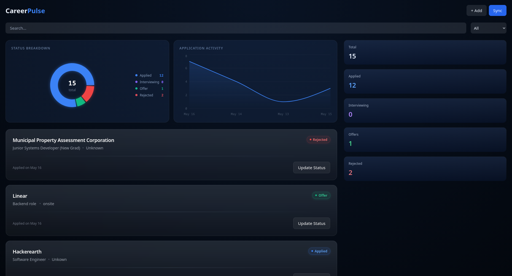
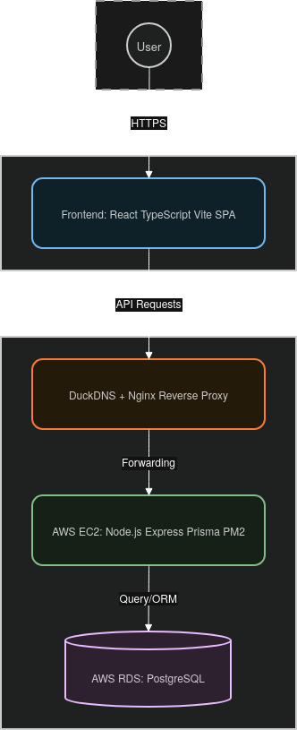
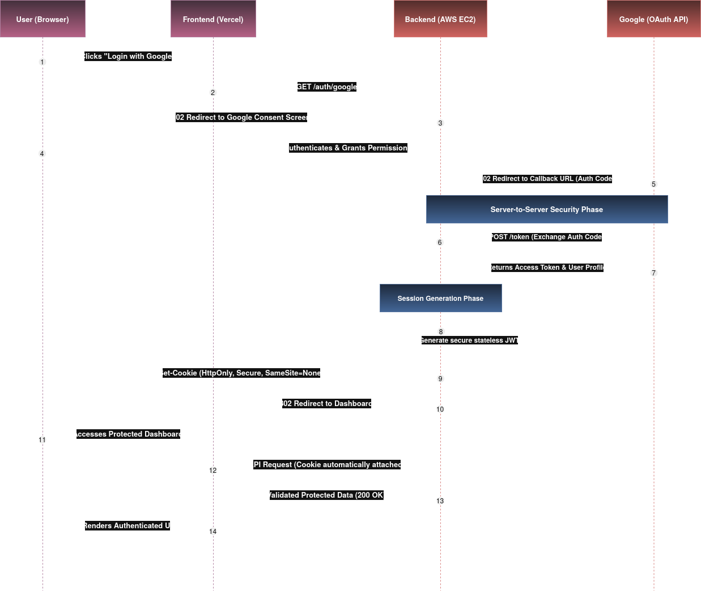
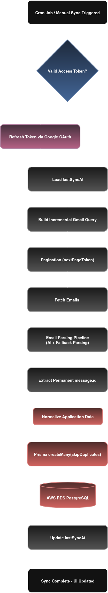
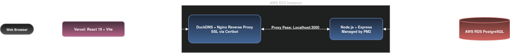

# CareerPulse

A full-stack application tracking platform that automatically synchronizes and organizes job application workflows directly from Gmail.

<br/>


---

## Table of Contents

- [Overview](#overview)
- [Application Dashboard](#application-dashboard)
- [Product Features](#product-features)
- [System Architecture](#system-architecture-and-data-flow)
- [Technology Stack](#technology-stack)
- [Database Design](#database-design)
- [Containerization Strategy](#containerization-strategy)
- [Security & Reliability](#security--reliability)
- [Engineering Challenges & Architectural Decisions](#engineering-challenges--architectural-decisions)
- [Local Development Setup](#local-development-setup)
- [Deployment Overview](#deployment-overview)
- [Roadmap](#roadmap)

---

## Overview

CareerPulse is a full-stack application tracking platform that automatically synchronizes and organizes job application workflows directly from Gmail.

The platform integrates with the Gmail API using Google OAuth 2.0, extracts application-related metadata from emails, and presents structured application data through a centralized dashboard.

The project focuses heavily on backend systems engineering and deployment architecture, including:

- Google OAuth 2.0 authentication and secure session management
- The project includes a queue-based synchronization architecture implemented using BullMQ and Redis to support asynchronous processing and future scalability.
- Incremental Gmail synchronization using synchronization checkpoints
- Paginated mailbox ingestion for large Gmail accounts
- AI-powered email parsing and structured data extraction
- PostgreSQL data modeling and query optimization using Prisma
- Reverse proxy networking with Nginx
- AWS EC2 and RDS infrastructure deployment
- Containerized local development using Docker Compose
- Runtime monitoring and process recovery using PM2

---

## Application Dashboard

<p align="center">
  
</p>

---

## Product Features

| Feature | Description |
|---|---|
| Gmail Synchronization | Synchronizes application-related emails directly from Gmail using the Gmail API |
| Application Tracking | Tracks company names, job roles, timestamps, and application statuses |
| Centralized Dashboard | Provides a unified interface for monitoring application workflows |
| Duplicate Prevention | Prevents duplicate application records during repeated synchronization cycles |
| Authentication System | Secure login using Google OAuth 2.0 |
| Status Management | Organizes applications across different recruitment stages |
| Incremental Synchronization | Fetches only emails received after the previous synchronization checkpoint|
| Queue-Based Processing | Implements a queue-based synchronization architecture using BullMQ and Redis |
| Large Mailbox Support | Uses Gmail pagination to process emails across multiple result pages | 
| AI-Powered Parsing | Extracts company names, roles, and work models from email content |   

---

## Technology Stack

| Layer | Technologies |
|---|---|
| Frontend | React 19, TypeScript, Vite, TailwindCSS |
| Backend | Node.js, Express.js, TypeScript |
| Database | PostgreSQL, Prisma ORM |
| Authentication | Google OAuth 2.0, JWT |
| Infrastructure | AWS EC2, AWS RDS, Nginx |
| Containerization | Docker, Docker Compose |
| Deployment & Runtime | PM2, Certbot, Vercel |
| Validation & Logging | Zod, Pino |
| Background Processing | node-cron, BullMQ, Redis |
| Data Visualization | Recharts |
| Testing & CI | Vitest, GitHub Actions |

---

## System Architecture and Data Flow

### High-Level Application Architecture

<p align="center">
  
</p>

- The application follows a distributed full-stack architecture with independently deployed frontend and backend services. Authentication, synchronization, processing, and persistent storage are separated into dedicated layers to simplify deployment and maintenance.

---

### Authentication & Session Flow

<p align="center">
  
</p>

- Authentication is handled through Google OAuth 2.0. After successful authorization, the backend generates JWT-based sessions stored in secure HttpOnly cookies. Cross-origin session persistence is enabled through credentialed CORS configuration between the frontend and backend services.

---

### Gmail Synchronization Pipeline


<p align="center">
  
</p>


- The synchronization pipeline supports a queue-based architecture using BullMQ and Redis for asynchronous email processing. The current production deployment performs scheduled synchronization through cron-based workers while preserving the same ingestion pipeline.

---

### Deployment Infrastructure

<p align="center">
  
</p>

- The frontend is deployed on Vercel, while the backend runs on an AWS EC2 instance behind an Nginx reverse proxy. PostgreSQL is hosted separately on AWS RDS and accessed through restricted security group rules. PM2 is used for process supervision, automatic recovery, and runtime management of backend services.

---

### Container & Service Architecture


- Docker Compose is used exclusively for local development and environment reproducibility. Production services are deployed directly on AWS infrastructure, with the backend running on an EC2 instance managed by PM2 and PostgreSQL hosted on AWS RDS. Docker is primarily used to standardize local development workflows and simplify onboarding.

---


## Database Design

### `User` Model

| Field | Type | Attributes | Description |
|--------|--------|------------|-------------|
| `id` | UUID | `@id @default(uuid())` | Primary key |
| `email` | String | `@unique` | Authorized email address |
| `name` | String | Optional | User display name |
| `googleId` | String | `@unique`, Optional | Google OAuth identity |
| `accessToken` | Text | Optional | Gmail API access token |
| `refreshToken` | Text | Optional | OAuth refresh token |
| `createdAt` | DateTime | `@default(now())` | Record creation timestamp |
| `updatedAt` | DateTime | `@updatedAt` | Last update timestamp |
| `lastSyncAt` | DateTime | Optional | Stores the timestamp of the most recent synchronization checkpoint |

---

### `Application` Model

| Field | Type | Attributes | Description |
|--------|--------|------------|-------------|
| `id` | UUID | `@id @default(uuid())` | Primary key |
| `messageId` | String | `@unique` | Immutable Gmail message identifier |
| `subject` | String | `@default("None")` | Email subject or application title |
| `sender` | String | `@default("None")` | Email sender information |
| `companyName` | String | — | Extracted company name |
| `role` | String | — | Job title or position |
| `status` | String | — | Current application stage |
| `workModel` | String | — | Remote, onsite, or hybrid work model |
| `userID` | UUID | `@relation`, Optional | Foreign key referencing `User` |
| `dateApplied` | DateTime | `@default(now())` | Application creation timestamp |
| `updatedAt` | DateTime | `@updatedAt` | Last update timestamp |

---

### Request Validation

Application requests are validated using Zod schemas before reaching the database.

#### Allowed Status Values

- applied
- interviewing
- offer
- rejected

#### Allowed Work Models

- remote
- onsite
- hybrid

---

## Containerization Strategy

The backend uses a multi-stage Docker build pipeline to separate compilation and runtime environments while reducing final image size.

### Builder Stage

- Deterministic dependency installation using `npm ci`
- TypeScript compilation
- Prisma client generation
- Optimized Docker layer caching

### Runner Stage

- Production-only dependencies
- Reduced runtime image size
- Non-root runtime user configuration
- Isolated runtime environment

---

## Security & Reliability

### Authentication & Session Security

| Area | Implementation |
|---|---|
| OAuth Authentication | User authentication handled through Google OAuth 2.0 |
| Session Management | JWT-based sessions stored in secure HttpOnly cookies |
| Cookie Security | `Secure` and `SameSite=None` policies configured for cross-origin deployments |
| Password Handling | No local password storage due to delegated OAuth authentication |
| Route Protection | Protected backend routes enforced through authentication middleware |

---

### Infrastructure Security

| Area | Implementation |
|---|---|
| HTTPS Enforcement | SSL/TLS handled through Nginx and Certbot |
| Reverse Proxy Isolation | Public traffic routed through Nginx before reaching backend services |
| Database Isolation | AWS RDS restricted through VPC security group rules |
| Secret Management | Environment variables isolated from source control and injected at runtime |
| Public Exposure Control | PostgreSQL instance not exposed directly to the public internet |

---

### Data Integrity & Validation

| Area | Implementation |
|---|---|
| Request Validation | Runtime schema validation implemented using Zod |
| Synchronization Consistency | Immutable Gmail message IDs used for idempotent synchronization |
| Duplicate Prevention | Prevents duplicate application records using immutable Gmail message identifiers |
| ORM Safety | Prisma schema enforcement used for relational consistency |

---

### Runtime Reliability

| Area | Implementation |
|---|---|
| Process Recovery | PM2 configured for automatic restart on runtime failures |
| Deployment Stability | Automated build and deployment workflow with PM2 process supervision |
| Logging | Structured application logging implemented using Pino |
| Runtime Isolation | Separate frontend, backend, and database deployment layers |

---

## Engineering Challenges & Architectural Decisions

A major focus of the project was understanding how deployment environments introduce constraints beyond application logic. Several architectural decisions were driven by issues encountered during authentication handling, infrastructure configuration, container networking, database isolation, and runtime stability.

### Cross-Origin Authentication & Session Persistence

**Problem**  
- The frontend and backend were deployed on separate domains, which caused browsers to reject authentication cookies during OAuth session flows.

**Solution**  
- JWT sessions were stored in secure HttpOnly cookies with `SameSite=None` and `Secure=true` policies. Credentialed CORS handling was explicitly configured between the frontend and backend, while Express proxy trust settings preserved forwarded HTTPS headers.

**Outcome**  
- Authentication sessions remained persistent across distributed deployments while maintaining secure cross-origin communication.

---

### Reverse Proxy & SSL Termination

**Problem**  
- The backend application needed secure public exposure without directly handling HTTPS encryption inside the Node.js runtime.

**Solution**  
- Nginx was deployed as a reverse proxy in front of the backend service. SSL/TLS certificates were provisioned through Certbot, allowing Nginx to handle HTTPS termination and securely forward upstream traffic to PM2-managed Node.js processes.

**Outcome**  
- The deployment achieved secure HTTPS communication and simplified operational traffic routing.

---

### AWS RDS Network Isolation

**Problem**  
- Initial Prisma database connections failed because the PostgreSQL instance was isolated behind default AWS VPC security restrictions.

**Solution**  
- Inbound security group rules were configured to allow PostgreSQL traffic only from the EC2 instance security group instead of exposing the database publicly.

**Outcome**  
- The database remained inaccessible from the public internet while supporting secure internal communication between application services.

---

### Container Networking & Service Discovery

**Problem**  
- Database connections inside Docker containers initially failed because `localhost` resolved to the container itself rather than the host machine.

**Solution**  
- Docker Compose service discovery was used to establish internal container communication through bridge networking and container aliases instead of host-based networking.

**Outcome**  
- The backend and database services communicated reliably within isolated container environments.

---

### Runtime Stability Under Limited Compute Resources

**Problem**  
- TypeScript compilation and Prisma client generation frequently triggered Linux OOM (Out Of Memory) kills on low-memory AWS instances during deployment builds.

**Solution**  
- Persistent swap memory was provisioned on the host machine, while multi-stage Docker builds isolated compilation workloads from the production runtime environment.

**Outcome**  
- Build stability improved significantly and deployment failures caused by memory exhaustion were eliminated.

---

### Idempotent Gmail Synchronization

**Problem**  
- Repeated Gmail synchronization cycles risked inserting duplicate application records into the database.

**Solution**  
- Immutable Gmail message identifiers were used as unique database constraints instead of generating new identifiers during every synchronization cycle. Prisma duplicate-skipping behavior safely ignored overlapping records.

**Outcome**  
- Synchronization became deterministic and duplicate database writes were prevented across repeated polling cycles.

---

### Deterministic Runtime Initialization

**Problem**  
- Prisma occasionally initialized before environment variables were loaded, causing database connection failures during application startup.

**Solution**  
- Environment variable injection was delegated to the PM2 runtime configuration to guarantee that all required credentials were available before the application boot sequence executed.

**Outcome**  
- Application startup became predictable and runtime initialization failures were eliminated.

--- 

### Incremental Email Synchronization

**Problem**

* Repeated synchronization cycles scanned previously processed emails, increasing Gmail API usage and synchronization latency.

**Solution**

* Introduced synchronization checkpoints using user-level timestamps. Gmail queries are dynamically restricted to emails received after the previous synchronization checkpoint. Pagination support was added to process emails across multiple Gmail result pages.

**Outcome**

* Reduced redundant email processing, improved synchronization efficiency, and enabled support for larger mailboxes without changing application behavior.


---

## Local Development Setup

### Prerequisites

Before running the project locally, ensure the following dependencies are installed:

- Node.js
- Docker & Docker Compose
- PostgreSQL
- Google OAuth credentials
- AWS account (optional for cloud deployment)

---

### Repository Setup

```bash
git clone <repository-url>
cd career-pulse
npm install
```

---

### Backend Configuration

Create a `.env` file inside the backend directory:

```env
DATABASE_URL=
JWT_SECRET=
CLIENT_ID=
CLIENT_SECRET=
GOOGLE_REDIRECT_URL=
FRONTEND_URL=
```

---

### Frontend Configuration

Create a `.env` file inside the frontend directory:

```env
VITE_API_URL=
```

---

### Running the Development Environment

Start the frontend and backend development environments:

```bash
npm run dev
```

This starts the frontend and backend services with hot reload enabled.

---

### Docker-Based Development

The project also supports containerized local development using Docker Compose:

```bash
docker compose up --build
```

This initializes isolated application and database services using internal Docker networking.

---

## Deployment Overview

### Frontend Deployment

The frontend application is deployed on Vercel as an independently hosted client application communicating with the backend through secure cross-origin requests.

---

### Backend Deployment

The backend service is hosted on AWS EC2 and managed through PM2 for runtime monitoring and automatic recovery. Nginx is used as a reverse proxy for HTTPS termination and upstream request forwarding.

---

### Database Infrastructure

PostgreSQL is hosted on AWS RDS within a restricted VPC configuration. Database access is limited through security group rules permitting traffic only from authorized backend services.

---

## Browser Compatibility Notes

CareerPulse relies on secure cross-origin session cookies between independently deployed frontend and backend services.

Browsers with strict privacy settings or third-party cookie blocking enabled may prevent authentication sessions from persisting correctly after login. In such cases, users may need to allow cross-site cookies for the application domain.

This limitation originates from modern browser privacy policies affecting cross-origin authentication flows in distributed web applications.

---

## Roadmap

### Infrastructure & Scalability

- Centralized logging and observability
- WebSocket-based live synchronization
- Kubernetes-based deployment experimentation

### Product Improvements

- Multi-provider email integration
- Enhanced analytics dashboard
- Resume version tracking

---

## License

This project is licensed under the MIT License. See the [LICENSE](./LICENSE) file for more information.
